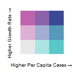

```{r packages, include=FALSE}
library(tidyverse)
library(tidycensus)
# library(mapview)
# library(tmap)
library(sf)
library(leaflet)
library(crosstalk)
library(plotly)
library(DT)
library(tmaptools)
library(zoo)
library(covdata)
library(janitor)
library(plm)
library(broom)
library(GGally)
library(biscale)
library(stargazer)
# library(summarywidget)
library(reticulate)
library(htmltools)
# tmap_mode('view')

options(tigris_use_cache = TRUE)
```

```{python get date in right format for USA Facts data}
from datetime import date, timedelta

yesterday = date.today() - timedelta(days=2)
yesterday_usa_facts_format = yesterday.strftime('%m/%d/%Y')

```

```{r get census data with shapefiles}
# B27010_051 65 and over pop
# B19083_001 Gini
# B16010_041 bachelor's or more
# B16010_001 25 and over (denominator for ed vars)
# B09021_023 65 and over lives alone
# B06011_001 median income

# name of Census variables to get from API
extra_vars <- c('B09021_023', 'B27010_051', 'B19083_001', 'B16010_041', 'B16010_001', 'B06011_001')

# us_county_test <- get_acs(geography = "county", year = 2018, variables = vars, 
#                           shift_geo = TRUE, geometry = TRUE)

# function to get extra vars - with geometry
extra_vars_geom <- get_acs(geography = "county", output = 'wide', year = 2018, variables = extra_vars, shift_geo = TRUE, geometry = TRUE)

# convert area of county to square miles
extra_vars_geom$mile2 <- st_area(extra_vars_geom$geometry) / 2589988.1103

# get county population and race data - without geometry
county_pop <- get_acs(geography = "county", output = 'wide', year = 2018, table = 'B03002', geometry = FALSE)

# get variables for people living in correctional and nursing facilities from 2010 Census
correctional_nursing_2010 <- get_decennial(geography = "county", output = 'wide', year = 2010, variables = c('P001001', 'P042003', 'P042005'), geometry = FALSE)

# merge three dataframes
county_merge <- list(extra_vars_geom, county_pop, correctional_nursing_2010)%>% 
  reduce(left_join, by = 'GEOID')

# create variables
county_merge <- county_merge %>% 
  mutate(prop_65_above = B27010_051E / B03002_001E,
         prop_hispanic = B03002_012E / B03002_001E,
         prop_nhblack = B03002_004E / B03002_001E,
         prop_nhwhite = B03002_003E / B03002_001E,
         pop_per_mile2 = B03002_001E / mile2,
         prop_college_above = B16010_041E / B16010_001E,
         prop_65_above_alone = B09021_023E / B27010_051E,
         prop_correctional_2010 = P042003 / P001001,
         prop_nursing_2010 = P042005 / P001001) %>% 
  rename(Gini = B19083_001E, 
         median_income = B06011_001E)
```

```{r}
# us <- unique(fips_codes$state)[1:51]

# tract population table - no geometry
# this takes a minute or so
# import poptable .csv below instead
# poptable <- reduce(
#   map(us, function(x) {
#     get_acs(geography = "tract", table = 'B03002', 
#             state = x, output = 'wide', geometry = FALSE)
#   }), 
#   rbind
# )
# 
# write_csv(poptable, 'tract_race_data.csv')

# import race data at the tract level
poptable <- read_csv('../tract_race_data.csv')

# create variables, create county FIPS var, and subset df
tract_data <- poptable %>%
  rename(nonhisp = B03002_002E,
         nhwhite = B03002_003E,
         nhblack = B03002_004E,
         hispanic = B03002_012E, 
         total_pop = B03002_001E,
         tract_id = GEOID) %>% 
  mutate(GEOID = substr(tract_id, 1,5)) %>%
  select(tract_id, nonhisp, nhwhite, nhblack, hispanic, total_pop, GEOID) %>%
  arrange(tract_id, GEOID)

# create county data from tract data
county_data <- tract_data %>%
  group_by(GEOID) %>%
  summarize(county_pop = sum(total_pop), county_white = sum(nhwhite), county_black = sum(nhblack), county_hispanic = sum(hispanic))

# join county and tract data
cty_tract <- inner_join(x = tract_data, y = county_data, by = 'GEOID')

# first step in creating segregation indices
tract_dis <- cty_tract %>% 
  mutate(diss_white_black = abs(nhwhite / county_white - nhblack / county_black),
         int_black_white = (nhblack / county_black * nhwhite / total_pop),
         iso_black = (nhblack / county_black * nhblack / total_pop))

# second step in creating segregation indices
county_dis <- tract_dis %>%
  group_by(GEOID) %>%
  summarize(dissimilarity_index = .5 * sum(diss_white_black, na.rm=T),
            interaction_index = sum(int_black_white, na.rm=T),
            black_isolation_index = sum(iso_black, na.rm=T))

# merge dissimilarity indices with county data from chunk above
county_w_diss <- inner_join(x = county_merge, y = county_dis, by = 'GEOID')
```

```{r import County Health Rankings data and merge}

# import County Health Rankings data (not publicly available)
health_rank_full <- read_csv('../health_county_full_2016.csv')

# list columns to keep from df
cols_to_keep <- c('Geo_QNAME', 'Geo_NAME', 'Geo_FIPS', 'ORG_HD2016_001_HEALTH_T6_V25', 'ORG_HD2016_001_HEALTH_T6_V13', 'ORG_HD2016_003_HEALTH_T9_V9', 'ORG_HD2016_006_HEALTH_T3_V42', 'ORG_HD2016_006_HEALTH_T3_V35', 'ORG_HD2016_006_HEALTH_T3_V25', 'ORG_HD2016_008_HEALTH_T2_V5')

# subset df and rename some vars
health_condense <- health_rank_full %>% 
  select(., all_of(cols_to_keep)) %>% 
  rename('Percent Uninsured (Ages 18-64)' = 'ORG_HD2016_003_HEALTH_T9_V9',
         'Percent Without Insurance (Under 65)' = 'ORG_HD2016_006_HEALTH_T3_V42',
         'Primary Care Physicians per 100K' = 'ORG_HD2016_006_HEALTH_T3_V35',
         'Preventable Hospital Stays per 100K Medicare enrollees' = 'ORG_HD2016_006_HEALTH_T3_V25',
         'Percent Obese (Ages 20 and Above)' = 'ORG_HD2016_008_HEALTH_T2_V5')

# replace NA with 0 for PCP variable
health_condense$`Primary Care Physicians per 100K`[is.na(health_condense$`Primary Care Physicians per 100K`)] <- 0

# merge in health data
health_counties <- inner_join(county_w_diss, health_condense, by = c("GEOID" = "Geo_FIPS"))

```

```{python}
import pandas as pd

# USA Facts cases data and df
usa_facts_cases_df = pd.read_csv('https://usafactsstatic.blob.core.windows.net/public/data/covid-19/covid_confirmed_usafacts.csv', dtype={'countyFIPS' : str, 'stateFIPS' : str})

# Check on this. Sometimes there's a column at the end that's nonsense, so I added this line. Remove if the last column is fine.
# usa_facts_cases_df = usa_facts_cases_df.iloc[:,:-1]

# rename columns
usa_facts_cases_df.columns = usa_facts_cases_df.columns[:4].tolist() + pd.to_datetime(usa_facts_cases_df.columns[4:]).strftime('%m/%d/%Y').tolist()

# usa_facts_cases_df.dtypes

# USA Facts deaths data and df
usa_facts_deaths_df = pd.read_csv('https://usafactsstatic.blob.core.windows.net/public/data/covid-19/covid_deaths_usafacts.csv', dtype={'countyFIPS' : str, 'stateFIPS' : str})

# rename columns
usa_facts_deaths_df.columns = usa_facts_deaths_df.columns[:4].tolist() + pd.to_datetime(usa_facts_deaths_df.columns[4:]).strftime('%m/%d/%Y').tolist()

# function to add leading zeros to FIPS
def add_leading_zero(text):
  if len(text) == 4:
    return '0' + text
  else:
    return text

# run function to add leading zeros to FIPS
usa_facts_cases_df['Geo_FIPS'] = usa_facts_cases_df['countyFIPS'].apply(add_leading_zero) 
usa_facts_deaths_df['Geo_FIPS'] = usa_facts_deaths_df['countyFIPS'].apply(add_leading_zero)
```


```{r import cases data and merge, message=FALSE, warning=FALSE}

# yesterday_jhhe_format <- format(Sys.Date()-1, "%m-%d-%Y")

# yest_usa_facts_format <- strftime(as.Date(Sys.Date()-1, "%m/%d/%Y"), format = "%#m/%d/%Y")

# # JHHE data
# cases_url <- paste0('https://raw.githubusercontent.com/CSSEGISandData/COVID-19/master/csse_covid_19_data/csse_covid_19_daily_reports/', yesterday_jhhe_format, '.csv')
# 
# # JHHE df
# cumulative_cases_yesterday <- read_csv(cases_url)
# 
# # JHHE US cases
# us_cases <- cumulative_cases_yesterday %>% 
#   filter(Country_Region == 'US') %>% 
#   rename('Geo_FIPS' = 'FIPS',
#          'Confirmed Cases' = 'Confirmed')

# names(py$usa_facts_deaths_df)

usa_facts_for_time_series <- py$usa_facts_cases_df %>% 
  filter(Geo_FIPS != '0') %>% 
  select(Geo_FIPS, '01/22/2020':py$yesterday_usa_facts_format)

counties_for_ts_merge <- st_drop_geometry(extra_vars_geom) %>% 
  select(Geo_FIPS = GEOID)

# merge time series Covid data with original counties data
counties_ts <- merge(usa_facts_for_time_series, counties_for_ts_merge, by = 'Geo_FIPS')

# names(py$usa_facts_cases_df)

# convert to long format to calculate case growth
cases_long <- counties_ts %>% 
  pivot_longer(cols = '01/22/2020':py$yesterday_usa_facts_format, names_to = 'Date', values_to = 'Confirmed Cases') %>% 
  arrange(Geo_FIPS, Date)

# create pct_change variable
cases_long_growth <- cases_long %>% 
  group_by(Geo_FIPS) %>%
  mutate(pct_change = ((`Confirmed Cases` - dplyr::lag(`Confirmed Cases`)) / dplyr::lag(`Confirmed Cases`)) * 100) %>% 
  mutate_if(is.numeric, list(~na_if(., Inf)))

# convert NaN to NA
cases_long_growth$pct_change[cases_long_growth$pct_change == 'NaN'] <- NA

# calculate 7 day rolling average
cases_long_growth <- cases_long_growth %>%
  mutate(moving_average = rollmean(pct_change, 7, align='right', fill=NA))

# cases_growth_no_missing <- cases_long_growth %>% 
#   filter(!is.na(moving_average))

# filter to just yesterday's cases
just_yest <- cases_long_growth %>% 
  filter(Date == py$yesterday_usa_facts_format)

# just_yest_no_missing <- just_yest %>% 
#   filter(!is.na(moving_average))

# summary(just_yest$moving_average)

# just_yest_no_missing_above_median <- just_yest_no_missing %>% 
#   filter(moving_average > median(just_yest_no_missing$moving_average),
#          `Confirmed Cases per 10K` > median(just_yest$`Confirmed Cases per 10K`))

# just_yest$per_capita_scaled <- scale(just_yest$`Confirmed Cases per 10K`)
# just_yest$growth_scaled <- scale(just_yest$moving_average)

# prev_growth_above_median <- merge(cases_growth_no_missing, just_yest_no_missing_above_median, by = 'Geo_FIPS')

# length(unique(prev_growth_above_median$Geo_FIPS))

# ggplot(prev_growth_above_median) +
#   geom_line(mapping = aes(x = `Confirmed Cases per 10K.x`, y = moving_average.x, color = Geo_FIPS)) +
#   scale_x_log10() +
#   scale_y_log10() +
#   theme(legend.position = "none")

usa_facts_cases <- py$usa_facts_cases_df %>% 
  select(Geo_FIPS, `County Name`, State, py$yesterday_usa_facts_format) %>% 
  rename('Confirmed Cases' = py$yesterday_usa_facts_format) %>% 
  filter(!is.na(`Confirmed Cases`)) %>% # filter out NAs, which in this df are duplicates, not missing data
  filter(Geo_FIPS != '0') 

usa_facts_deaths <- py$usa_facts_deaths_df %>% 
  select(Geo_FIPS, `County Name`, State, py$yesterday_usa_facts_format) %>% 
  rename('Deaths' = py$yesterday_usa_facts_format) %>% 
  filter(!is.na(Deaths)) %>% # filter out NAs, which in this df are duplicates, not missing data
  filter(Geo_FIPS != '0') 

# merge cases and deaths df's
usa_facts_merge = merge(usa_facts_cases, usa_facts_deaths, by = c('Geo_FIPS', 'State'))

# create df of just one obs per county with case numbers, deaths, and growth rates
counties_w_growth_rates = merge(usa_facts_merge, just_yest, by = c('Geo_FIPS', 'Confirmed Cases'))

# length(unique(us_cases$Geo_FIPS))

# test_merge = merge(us_cases, usa_facts_cases, by = 'Geo_FIPS')

# With JHHE data
# cases_health_counties <- merge(health_counties, us_cases, by = 'Geo_FIPS')
# 
# cases_health_counties <- cases_health_counties %>% 
#   mutate('Confirmed Cases per 10K' = `Confirmed Cases` / (B27010_001 / 10000)) %>% 
#   mutate('Confirmed Cases per 100K' = `Confirmed Cases` / (B27010_001 / 100000))

# merge census-health indicators df with USA Facts data
cases_health_counties <- inner_join(health_counties, counties_w_growth_rates, by = c('GEOID' = 'Geo_FIPS'))

# create vars
cases_health_counties <- cases_health_counties %>% 
  mutate('Confirmed Cases per 10K' = `Confirmed Cases` / (B03002_001E / 10000)) %>% 
  mutate('Confirmed Cases per 100K' = `Confirmed Cases` / (B03002_001E / 100000)) %>%
  mutate('Deaths per 10K' = Deaths / (B03002_001E / 10000)) %>% 
  mutate('Deaths per 100K' = Deaths / (B03002_001E / 100000))

# create state population var from counties pop
cases_health_counties <- cases_health_counties %>% 
  group_by(State) %>% 
  mutate(state_pop = sum(B03002_001E))
```

```{r}
# hosp_16 <- read_csv('hosp16_atlas.csv')
# 
# beds_by_county <- hosp_16 %>% 
#   group_by(FCOUNTY) %>% 
#   summarize(hospital_beds = sum(AHAbeds, na.rm = TRUE))

# import hospital beds data
hifld_hosp <- read_csv('../HIFLD_Hospitals.csv')

# replace -999 with 0
hifld_hosp$BEDS[hifld_hosp$BEDS== -999] <- 0

# get df of beds by county
hifld_beds_by_county <- hifld_hosp %>%
  group_by(COUNTYFIPS) %>% 
  summarize(hospital_beds = sum(BEDS, na.rm = TRUE))

# beds_merge <- merge(beds_by_county, hifld_beds_by_county, by.x = 'FCOUNTY', by.y = 'COUNTYFIPS')
# 
# cor.test(beds_merge$hospital_beds.x, beds_merge$hospital_beds.y)

# merge in bed data
w_hosp_merge <- merge(cases_health_counties, hifld_beds_by_county, by.x = 'GEOID', by.y = 'COUNTYFIPS', all.x = T)

# names(w_hosp_merge)
# 
# summary(w_hosp_merge$hospital_beds)

# replace NA in beds variable with 0
w_hosp_merge$hospital_beds[is.na(w_hosp_merge$hospital_beds)] <- 0
```

```{r}
# function to get covid tests by state
covid_tests_by_state <- covus %>% 
  group_by(date, state, measure) %>% 
  filter(measure == 'positive' | measure == 'negative') %>% 
  summarize(total_of_measure = sum(count)) %>% 
  group_by(state, date) %>% 
  mutate(total_tests = sum(total_of_measure)) %>% 
  arrange(desc(total_tests)) %>% 
  group_by(state) %>% 
  slice(which.max(as.Date(date, '%m/%d/%Y'))) %>% 
  select(state, total_tests) %>% 
  rename(State = state) %>% 
  arrange(desc(total_tests))

# merge in tests data
full_w_tests <- inner_join(w_hosp_merge, covid_tests_by_state, by = 'State')

# create tests per capita var
full_w_tests$tests_per_capita <- full_w_tests$total_tests / full_w_tests$state_pop
```

```{r}
# names(w_hosp_merge)

# create condensed df
condensed_df <- full_w_tests %>% 
  select(GEOID, Geo_NAME, State, B03002_001E, starts_with('prop'), starts_with('pop'), starts_with('P0'), `Percent Without Insurance (Under 65)`, `Primary Care Physicians per 100K`, `Preventable Hospital Stays per 100K Medicare enrollees`, `Percent Obese (Ages 20 and Above)`, median_income, Gini, dissimilarity_index, interaction_index, black_isolation_index, `Confirmed Cases`, Deaths, `Confirmed Cases per 10K`, `Deaths per 10K`, moving_average, hospital_beds, tests_per_capita, geometry)

# write_csv(condensed_df, '../covid_data_june30.csv')
# st_write(condensed_df, '../covid_data_july8_spatial.shp')

# rename vars and create new ones for online table
clean_df <- condensed_df %>% 
  rename('Total Population' = B03002_001E,
         'Black-White Dissimilarity Index' = dissimilarity_index,
         'Hospital Beds' = hospital_beds,
         'Median Income' = median_income,
         'Average Daily Percent Change (Past 7 Days)' = moving_average, 
         'Tests Per Capita (State Level)' = tests_per_capita) %>% 
  mutate('Percent Population 65 and Above' = prop_65_above * 100,
         'Percent Black' = prop_nhblack * 100,
         'Percent Hispanic' = prop_hispanic * 100,
         'Percent College Degree' = prop_college_above * 100,
         'People Living in Nursing Homes per 1K (2010)' = P042005 / (P001001 / 1000),
         'People Living in Correctional Facilities per 1K (2010)' = P042003 / (P001001 / 1000),
         'Hospital Beds per 1K' = `Hospital Beds` / (`Total Population` / 1000),
         'Per Capita Cases Above Median' = ifelse(`Confirmed Cases per 10K` > median(w_hosp_merge$`Confirmed Cases per 10K`), 'Yes', 'No'),
        'Average Growth Rate Above Median' = ifelse(
         `Average Daily Percent Change (Past 7 Days)` > summary(`Average Daily Percent Change (Past 7 Days)`)[[3]] & !is.na(`Average Daily Percent Change (Past 7 Days)`), 'Yes',
         ifelse(
          `Average Daily Percent Change (Past 7 Days)` <= summary(`Average Daily Percent Change (Past 7 Days)`)[[3]] & !is.na(`Average Daily Percent Change (Past 7 Days)`), 'No', NA))) %>% 
        select(GEOID, Geo_NAME, State, `Confirmed Cases`, Deaths, `Confirmed Cases per 10K`, `Deaths per 10K`, `Average Daily Percent Change (Past 7 Days)`, `Total Population`, `Percent Population 65 and Above`, `Percent Black`, `Percent Hispanic`, `Black-White Dissimilarity Index`, `Median Income`, Gini, `People Living in Nursing Homes per 1K (2010)`, `People Living in Correctional Facilities per 1K (2010)`, `Percent Obese (Ages 20 and Above)`, `Hospital Beds`, `Hospital Beds per 1K`, `Percent Without Insurance (Under 65)`, `Primary Care Physicians per 100K`, `Preventable Hospital Stays per 100K Medicare enrollees`, `Tests Per Capita (State Level)`, `Per Capita Cases Above Median`, `Average Growth Rate Above Median`, geometry)

# , `Average Daily Percent Change (Past 7 Days)`
# , `Average Growth Rate Above Median`

```

```{r reproject and create map, include=FALSE}

# transform map projection of above df
cases_counties_final <- st_transform(clean_df, crs = 4326)
# shared_cty <- SharedData$new(cases_counties_final)

# ---- Map for Per Capita Cases Only

# # using fisher instead of jenks classification
# jenks_bins <- classInt::classIntervals(cases_counties_final$`Confirmed Cases per 10K`, n = 5, style = 'fisher')
# 
# labels <- sprintf(
#   "<strong>%s</strong><br/>Confirmed Cases: %g<br/>Confirmed Cases per 10K: %g",
#   cases_counties_final$Geo_NAME, cases_counties_final$`Confirmed Cases`, round(cases_counties_final$`Confirmed Cases per 10K`, 2))
# 
# bins <- round(jenks_bins$brks, 2)
# 
# pal <- colorBin(
#   palette = "YlGnBu",
#   domain = cases_counties_final$`Confirmed Cases per 10K`,
#   bins = bins
# )
# 
# leaf_map <- cases_counties_final %>% 
#   leaflet() %>% 
#   setView(-96, 37.8, 5) %>% 
#   addProviderTiles(provider = "CartoDB.Positron", group = 'Base') %>%
#   addPolygons(group = 'Counties', 
#               label = lapply(labels, htmltools::HTML),
#     fillColor = ~pal(cases_counties_final$`Confirmed Cases per 10K`),
#     stroke = TRUE,
#     fillOpacity = 0.7,
#     weight = 0.4) %>% 
#     addLegend("bottomright",
#     pal = pal,
#     values = ~ `Confirmed Cases per 10K`,
#     title = "Confirmed Cases per 10K",
#     opacity = 1) %>% 
#   addLayersControl(
#         baseGroups = 'Base',
#         overlayGroups = 'Counties',
#         options = layersControlOptions(collapsed = TRUE)
#       )

# ---- Map for Per Capita Cases and Growth Rates (Jenks breaks)

# create column with fisher classification of two variables (cases per capita and growth rate)
df_w_bivar <- bi_class(cases_counties_final, x = `Confirmed Cases per 10K`, y = `Average Daily Percent Change (Past 7 Days)`, style = 'fisher', keep_factors = T, dim = 3)

# create the color palette for 3X3 classification
bi_palette <- bi_pal(pal = "DkBlue", dim = 3, preview = FALSE)

# if growth rate is NA (because no growth in last 7 days), include in lowest classification
df_w_bivar <- df_w_bivar %>% 
  mutate(bi_class = str_replace(bi_class, 'NA', '1'))

# make the bivariate column a factor and align levels with color palette
df_w_bivar$bi_class <- factor(df_w_bivar$bi_class, levels = names(bi_palette))

# summary(df_w_bivar$bi_class)

# color palette for leaflet map
factor_pal <- colorFactor(
  palette = bi_palette,
  domain = df_w_bivar$bi_class
)

# create legend
legend <- bi_legend(pal = "DkBlue",
                    dim = 3,
                    xlab = "Higher Per Capita Cases",
                    ylab = "Higher Growth Rate",
                    size = 10)

# save legend as picture and html (for leaflet)
capturePlot(legend, filename = 'legend.html', width = 150, height = 150)
ggsave(legend, filename = 'legend.png')

html_legend <- ""

# labels for map
labels_v2 <- sprintf(
  "<strong>%s</strong><br/>Confirmed Cases per 10K: %g<br/>Average Daily Percent Change (Past 7 Days): %g",
  df_w_bivar$Geo_NAME, round(df_w_bivar$`Confirmed Cases per 10K`, 2), round(df_w_bivar$`Average Daily Percent Change (Past 7 Days)`, 2))

# create leaflet map
bivar_leaf_map <- df_w_bivar %>% 
  leaflet() %>% 
  setView(-96, 37.8, 5) %>% 
  addProviderTiles(provider = "CartoDB.Positron", group = 'Base') %>%
  addPolygons(label = lapply(labels_v2, htmltools::HTML),
              fillColor = ~factor_pal(df_w_bivar$bi_class),
    stroke = T,
    fillOpacity = 1,
    weight = 0.4) %>%
  addLayersControl(
        baseGroups = 'Base',
        overlayGroups = 'Counties',
        options = layersControlOptions(collapsed = TRUE)
      ) %>% 
  addControl(html = html_legend,
             position = 'bottomright')

```

Per Capita Cases and Growth Rates By County
=============================================================

### Data Updated as of `r format(Sys.Date()-1, "%B %d, %Y")`

```{r map, message=FALSE, warning=FALSE}

# Per Capita map
# leaf_map

# Per Capita and Growth Rate map
bivar_leaf_map

```

> Data Sources: [Johns Hopkins University Center for Systems Science and Engineering](https://github.com/CSSEGISandData/COVID-19), [USAFacts](https://usafacts.org/visualizations/coronavirus-covid-19-spread-map/), [American Community Survey 2018 (5-Year Estimates)](https://www.census.gov/)</br>
> Notes: Does not include cases not assigned to counties.</br>3X3 bivariate choropleths use Fisher-Jenks breaks. For a map using quantile breaks, download the quantile_bivar_map.html file [here](https://github.com/alturkaa/socio-cov).

```{r quantile bivar map, include=FALSE}
# ---- Map for Per Capita Cases and Growth Rates (quantile breaks)

# create column with fisher classification of two variables (cases per capita and growth rate)
quantile_w_bivar <- bi_class(cases_counties_final, x = `Confirmed Cases per 10K`, y = `Average Daily Percent Change (Past 7 Days)`, style = 'quantile', keep_factors = T, dim = 3)

# if growth rate is NA (because no growth in last 7 days), include in lowest classification
quantile_w_bivar <- quantile_w_bivar %>% 
  mutate(bi_class = str_replace(bi_class, 'NA', '1'))

# make the bivariate column a factor and align levels with color palette
quantile_w_bivar$bi_class <- factor(quantile_w_bivar$bi_class, levels = names(bi_palette))

# color palette for leaflet map
quantile_factor_pal <- colorFactor(
  palette = bi_palette,
  domain = quantile_w_bivar$bi_class
)

# create leaflet map
quantile_bivar_leaf_map <- quantile_w_bivar %>% 
  leaflet() %>% 
  setView(-96, 37.8, 5) %>% 
  addProviderTiles(provider = "CartoDB.Positron", group = 'Base') %>%
  addPolygons(label = lapply(labels_v2, htmltools::HTML),
              fillColor = ~quantile_factor_pal(quantile_w_bivar$bi_class),
              stroke = T,
              fillOpacity = 1,
              weight = 0.4) %>%
  addLayersControl(
    baseGroups = 'Base',
    overlayGroups = 'Counties',
    options = layersControlOptions(collapsed = TRUE)
  ) %>% 
  addControl(html = html_legend,
             position = 'bottomright')

# save quantile breaks map
save_html(quantile_bivar_leaf_map, file = 'quantile_bivar_map.html')
```

Social Risk Factors By County
===========================================================

```{r}

# take out geometry from df
df_no_geom <- st_drop_geometry(clean_df)

# round numeric columns to 2 sig digits
df_no_geom <- df_no_geom %>% 
  mutate_if(is.numeric, round, digits = 2)

# create median and quintile vars for interactive feature on site
cases_median <- summary(df_no_geom$`Confirmed Cases per 10K`)[[3]]
cases_p75 <- summary(df_no_geom$`Confirmed Cases per 10K`)[[5]]

growth_median <- summary(df_no_geom$`Average Daily Percent Change (Past 7 Days)`)[[3]]
growth_p75 <- summary(df_no_geom$`Average Daily Percent Change (Past 7 Days)`)[[5]]

prop_black_median <- summary(df_no_geom$`Percent Black`)[[3]]
prop_black_p75 <- summary(df_no_geom$`Percent Black`)[[5]]

beds_p25 <- summary(df_no_geom$`Hospital Beds per 1K`)[[2]]
beds_median <- summary(df_no_geom$`Hospital Beds per 1K`)[[3]]

uninsured_median <- summary(df_no_geom$`Percent Without Insurance (Under 65)`)[[3]]
uninsured_p75 <- summary(df_no_geom$`Percent Without Insurance (Under 65)`)[[5]]

# pcp_p25 <- summary(df_no_geom$`Primary Care Physicians per 100K`)[[2]]
# pcp_median <- summary(df_no_geom$`Primary Care Physicians per 100K`)[[3]]

# summary(df_no_geom$`Primary Care Physicians per 100K`)

# make a shareable dataframe for interactive feature
counties_table <- SharedData$new(df_no_geom)

# create html table
html_table <- datatable(counties_table, rownames = FALSE, style="bootstrap", class="compact", width="100%", options=list(order = list(6, "desc"), pageLength = 15))
```


Filters {.sidebar}
-----------------------------------------------------------------------
Use **sliders** and **checkboxes** to filter table. Refresh your browser to restart filtering.

```{r}
# filter_slider("Confirmed Cases per 10K", "Confirmed Cases per 10K", counties_table, column=~`Confirmed Cases per 10K`, round = 1)
filter_checkbox("Per Capita Cases Above Median", "Per Capita Cases Above Median?", counties_table, ~`Per Capita Cases Above Median`, inline = TRUE)
# min = summary(df_no_geom$`Confirmed Cases per 10K`)[[2]],
```

**Median:** `r round(cases_median, 2)`</br>
**75th Percentile:** `r round(cases_p75, 2)`

```{r}
filter_checkbox("Average Growth Rate Above Median", "Average Daily Percent Change (Past Week) Above Median?", counties_table, ~`Average Growth Rate Above Median`, inline = TRUE)
# min = summary(df_no_geom$`Confirmed Cases per 10K`)[[2]],
```

**Median:** `r round(growth_median, 2)`</br>
**75th Percentile:** `r round(growth_p75, 2)`

```{r}
filter_slider("Percent Black", "Percent Black", counties_table, column=~`Percent Black`, round = 2)
# min = summary(df_no_geom$`Percent Black`)[[2]],
```

**Median:** `r round(prop_black_median, 2)`</br>
**75th Percentile:** `r round(prop_black_p75, 2)`

```{r}
filter_slider("Hospital Beds per 1K", "Hospital Beds per 1K", counties_table, column=~`Hospital Beds per 1K`, round = 2)
# max = summary(df_no_geom$`Hospital Beds per 1K`)[[5]],
```

**25th Percentile:** `r round(beds_p25, 2)`</br>
**Median:** `r round(beds_median, 2)`

```{r}
filter_slider("Percent Without Insurance (Under 65)", "Percent Without Insurance (Under 65)", counties_table, column=~`Percent Without Insurance (Under 65)`, round = 2)
# min = summary(df_no_geom$`Percent Without Insurance (Under 65)`)[[2]],
```

**Median:** `r round(uninsured_median, 2)`</br>
**75th Percentile:** `r round(uninsured_p75, 2)`

Column
-----------------

### 

```{r}
html_table
```

> Data Sources: [Johns Hopkins University Center for Systems Science and Engineering](https://github.com/CSSEGISandData/COVID-19), [USAFacts](https://usafacts.org/visualizations/coronavirus-covid-19-spread-map/), [American Community Survey 2018 (5-Year Estimates)](https://www.census.gov/), [County Health Rankings](https://www.countyhealthrankings.org/), [Homeland Infrastructure Foundation-Level Data](https://hifld-geoplatform.opendata.arcgis.com/datasets/6ac5e325468c4cb9b905f1728d6fbf0f_0)</br>
> Note: Does not include cases not assigned to counties.

<!-- Growth Rates By County -->
<!-- =========================================================== -->

<!-- Filters {.sidebar} -->
<!-- ----------------------------------------------------------------------- -->
<!-- Use the **sliders** and **table** from the previous page to filter out the interactive chart to the right, or vice versa. Refresh your browser to restart filtering. -->

<!-- Column -->
<!-- ----------------- -->

<!-- ###  -->

<!-- ```{r} -->
<!-- # names(condensed_df) -->
<!-- yest_cases_growth <- ggplot(counties_table) + -->
<!--   geom_point(aes(x = `Confirmed Cases per 10K`, y = `Average Daily Percent Change (Past 7 Days)`, text = paste0("County: ", Geo_NAME, " ", State))) + -->
<!--   geom_hline(yintercept = growth_median, linetype = 'dashed', color = 'green') + -->
<!--   geom_hline(yintercept = growth_p75, linetype = 'dashed', color = 'red') + -->
<!--   geom_vline(xintercept = cases_median, linetype = 'dashed', color = 'green') + -->
<!--   geom_vline(xintercept = cases_p75, linetype = 'dashed', color = 'red') + -->
<!--   scale_x_log10() + -->
<!--   scale_y_log10() + -->
<!--   labs(title = 'Average Daily Case Growth vs. Prevalence', -->
<!--        caption = 'Only Counties with First Case at least One Week Ago\nGreen Dashed Lines: Median\nRed Dashed Lines: 75th Percentile') + -->
<!--   theme_minimal()  -->

<!-- ggplotly(yest_cases_growth) %>% -->
<!--   highlight("plotly_selected") -->

<!-- # options(persistent = TRUE) -->

<!-- ``` -->

<!-- > Notes: Cases and average 7-day growth rates updated as of `r format(Sys.Date()-1, "%B %d, %Y")`.</br> -->
<!-- Includes only counties with first case at least one week ago.</br> -->
<!-- Green Dashed Lines: Median</br> -->
<!-- Red Dashed Lines: 75th Percentile -->

Preliminary Analysis {style="position:relative;"}
===========================================================

```{r, include=FALSE}
condensed_df <- condensed_df %>%
  rename(population = B03002_001E) %>% 
  mutate(hospital_beds_per_10k = hospital_beds / (population / 10000))

# import in religious and civic orgs data
relsoc <- read_csv('../../social_capital/115967-V1/nanda_relcivsoc_tract_2006-2015_01P_csv_with_readme/nanda_relcivsoc_tract_2006-2015_01P.csv')

# import in parks data
parks <- read_csv('../../social_capital/117921-V1/nanda_parks_tract_2018_01P_csv_with_readme/nanda_parks_tract_2018_01P.csv')

# import in social services data
soc_service <- read_csv('../../social_capital/117163-V1/nanda_socsvcs_tract_2006-2015_01P_csv_with_readme/nanda_socsvcs_tract_2006-2015_01P.csv')

# for next three chunks, create vars, subset and get total numbers by county
rs_county <- relsoc %>% 
  mutate(GEOID = substr(tract_fips10, 1,5)) %>% 
  select(tract_fips10, GEOID, totpop10, starts_with('count_15'), starts_with('density_15')) %>% 
  group_by(GEOID) %>%
  summarize(rel_orgs = sum(count_15_8131),
            civic_orgs = sum(count_15_8134))

soc_service_county <- soc_service %>% 
  mutate(GEOID = substr(tract_fips10, 1, 5)) %>% 
  select(tract_fips10, GEOID, count_15_624, count_15_624120) %>% 
  group_by(GEOID) %>% 
  summarize(soc_assist_orgs = sum(count_15_624),
            elderly_disab_orgs = sum(count_15_624120))

parks_county <- parks %>%
  mutate(GEOID = substr(tract_fips10, 1,5)) %>% 
  select(tract_fips10, GEOID, tract_area_sqmiles, any_open_park, count_open_parks, tot_park_area_sqmiles, prop_park_area_tract) %>% 
  group_by(GEOID) %>%
  summarize(total_parks = sum(count_open_parks),
            total_park_area_sqmiles = sum(tot_park_area_sqmiles))

# join three dfs
county_orgs <- list(rs_county, parks_county, soc_service_county) %>%
  reduce(inner_join, by="GEOID")

# merge with original df
cov_w_orgs <- inner_join(condensed_df, county_orgs, by = 'GEOID')

# clean names function from janitor
cov_w_orgs <- clean_names(cov_w_orgs)

# create fatality rate indicator
cov_w_orgs$fatality <- cov_w_orgs$deaths / cov_w_orgs$confirmed_cases

# create per capita vars
cov_w_orgs <- cov_w_orgs %>% 
  mutate(rel_per_10k = rel_orgs / (population / 10000),
         civic_per_10k = civic_orgs / ( population / 10000),
         parks_per_10k = total_parks / (population / 10000),
         park_area_per_10k = total_park_area_sqmiles / (population / 10000),
         eld_dis_per_10k = elderly_disab_orgs / (population / 10000),
         soc_assist_per_10k = soc_assist_orgs / (population / 10000),
         nursing_per_10k = prop_nursing_2010 * 10000,
         correctional_per_10k = prop_correctional_2010 * 10000,
         tests_per_10k = tests_per_capita * 10000)

# scale all numeric vars
scaled_df <- cov_w_orgs %>%
  mutate_if(is.numeric, scale)

# create list of old and new names for renaming
old_names <- c('pop_per_mile2', 'prop_65_above', 'prop_nhblack','prop_hispanic', 'median_income', 'gini', 'dissimilarity_index', 'interaction_index', 'prop_college_above', 'correctional_per_10k', 'nursing_per_10k', 'percent_obese_ages_20_and_above', 'percent_without_insurance_under_65', 'primary_care_physicians_per_100k', 'hospital_beds_per_10k', 'rel_per_10k', 'civic_per_10k', 'parks_per_10k', 'eld_dis_per_10k')

new_names <- c('Population Density', '% 65 and Above', '% Black', '% Hispanic', 'Median Income', 'Gini Index (Economic Inequality)', 'Black-White Dissimilarity Index', 'Black-White Interaction Index', '% College Degree', '% Living in Correctional Facility', '% Living in Nursing Home', '% Obese', '% Without Health Insurance', 'Primary Care Doctors', 'Hospital Beds', 'Religious Organizations', 'Civic Organizations', 'Parks', 'Service Orgs Focused on Elderly/Disabled')

# fixed effects model 
cases_orgs_plm <- plm(confirmed_cases_per_10k ~ pop_per_mile2 + prop_65_above + prop_nhblack + prop_hispanic + median_income + gini + dissimilarity_index + interaction_index + prop_college_above + correctional_per_10k + nursing_per_10k + percent_obese_ages_20_and_above + percent_without_insurance_under_65 + primary_care_physicians_per_100k + hospital_beds_per_10k + rel_per_10k + civic_per_10k + parks_per_10k + eld_dis_per_10k, data = scaled_df, model = 'within', index = 'state')

# create table of model results
cases_model_df <- tidy(cases_orgs_plm, conf.int = TRUE) %>% 
  filter(!str_detect(term, 'factor|Intercept'))

# rename terms using lists above
new_terms_cases <- plyr::mapvalues(cases_model_df$term, from = old_names, to = new_names)
cases_model_df$term <- new_terms_cases

# get only significant (at 0.05 level) IVs
cond_cases_model <- cases_model_df %>% 
  filter(p.value < 0.05 & !str_detect(term, 'tests'))

# reorder vars for plot
cases_new_order <- order(cond_cases_model$estimate, decreasing = FALSE)
cond_cases_model$term <- as.character(cond_cases_model$term)
cond_cases_model$term <- factor(cond_cases_model$term, levels = cond_cases_model$term[cases_new_order])

# plot coefficient plot
plot_cases <- ggplot(cond_cases_model, aes(x=term, y = estimate)) + 
  geom_hline(yintercept=0, colour="#8C2318") +  # Line at 0
  geom_pointrange(aes(ymin=conf.low, ymax=conf.high)) +  # Ranges for each coefficient
  labs(x="Coefficient", y="Estimate", title="Coefficient Estimates of Regression Model\nof Covid-19 Cases per Capita") +
  coord_flip() +
  theme_minimal()

# fixed effects model
deaths_orgs_plm <- plm(deaths_per_10k ~ pop_per_mile2 + prop_65_above + prop_nhblack + prop_hispanic + median_income + gini + dissimilarity_index + interaction_index + prop_college_above + correctional_per_10k + nursing_per_10k + percent_obese_ages_20_and_above + percent_without_insurance_under_65 + primary_care_physicians_per_100k + hospital_beds_per_10k + rel_per_10k + civic_per_10k + parks_per_10k + eld_dis_per_10k, data = scaled_df, model = 'within', index = 'state')

# create table of model results
deaths_model_df <- tidy(deaths_orgs_plm, conf.int = TRUE) %>% 
  filter(!str_detect(term, 'factor|Intercept'))

# rename terms using lists above
new_terms_deaths <- plyr::mapvalues(deaths_model_df$term, from = old_names, to = new_names)
deaths_model_df$term <- new_terms_deaths

# keep only sig. IVs
cond_deaths_model <- deaths_model_df %>% 
  filter(p.value < 0.05 & !str_detect(term, 'tests'))

# reorder vars for plot
deaths_new_order <- order(cond_deaths_model$estimate, decreasing = FALSE)
cond_deaths_model$term <- as.character(cond_deaths_model$term)
cond_deaths_model$term <- factor(cond_deaths_model$term, levels = cond_deaths_model$term[deaths_new_order])

# plot coefficients plot
plot_deaths <- ggplot(cond_deaths_model, aes(x=term, y = estimate)) + 
  geom_hline(yintercept=0, colour="#8C2318") +  # Line at 0
  geom_pointrange(aes(ymin=conf.low, ymax=conf.high)) +  # Ranges for each coefficient
  labs(x="Coefficient", y="Estimate", title=paste0('Coefficient Estimates of Regression Model of Covid-19\nDeaths per Capita, January 22 - ', format(Sys.Date()-1, "%B %d"))) +
  coord_flip() +
  theme_minimal()

# save coef plot
ggsave(plot_deaths, filename = paste0('coef_plot_', Sys.Date()-1, '.png'))

```

Column {style="height:48pc;"}
-------------------------------------

### Regression Model

```{r results='asis'}

# create list of IVs
iv_list <- c('Population Density', '% 65 and Above', '% Black', '% Hispanic', 'Median Income', 'Gini Index (Economic Inequality)', 'Black-White Dissimilarity Index', 'Black-White Interaction Index', '% College Degree', '% Living in Correctional Facility', '% Living in Nursing Home', '% Obese', '% Without Health Insurance', 'Primary Care Doctors', 'Hospital Beds', 'Religious Organizations', 'Civic Organizations', 'Parks', 'Service Orgs Focused on Elderly/Disabled', '(Intercept)')

# create title
title <- paste0('Fixed Effects Model of Covid-19 Deaths per Capita in U.S. Counties, January 22 - ', format(Sys.Date()-1, "%B %d"))

# stargazer table
stargazer(deaths_orgs_plm, df = FALSE, dep.var.labels = 'Deaths per Capita', covariate.labels = iv_list, title = title, type = 'html', single.row = TRUE, omit = 'factor', notes = 'Variables are population weighted and scaled, with a mean of 0 and standard deviation of 1.</br><span>&#42;&#42;&#42;</span>: p<0.001; <span>&#42;&#42;</span>: p<0.01; <span>&#42;</span>: p<0.05', notes.append = FALSE, add.lines = list(c('State Fixed Effects?', 'Yes')), digits = 2, column.sep.width = '1pt', star.cutoffs = c(0.05, 0.01, 0.001), out = paste0('covid_deaths_regression_', Sys.Date()-1, '.html'))

```

Column
-------------------------------------

### Coefficients Plot

```{r}
ggplotly(plot_deaths)
```

> Notes: Unit of analysis: U.S. counties.</br>Only statistically significant variables at the .05 level are included in the coefficient plot. Other variables can be found in the table to the left.</br>Bands are 95% confidence intervals.

Analysis Details
===========================================================

#### **Data Sources**

Data for the analysis come from various sources. 

##### **Cases and Deaths**

Confirmed cases and deaths come from USAFacts, which [collect](https://usafacts.org/visualizations/coronavirus-covid-19-spread-map/) the data from state and local agencies. The number of viral tests given, at the state level, come from the [COVID Tracking Project](https://covidtracking.com/), but they are not included in the analysis (see below).

##### **Demographic and Socioeconomic Indicators**

Demographic and socioeconomic indicators -- including total population, racial and ethnic makeup, income measures (both median income and income inequality), and education levels -- all come from five-year estimates from the Census Bureau's 2014-2018 [American Community Survey](https://www.census.gov/newsroom/press-releases/2019/acs-5-year.html). Data for number of people living in correctional facilities and nursing homes come from the 2010 Decennial Census. 

##### **Health indicators**

Health indicators -- the number of people that are obese, the number without health insurance, and the number of primary care physicians -- come from the [County Health Rankings](https://www.countyhealthrankings.org/). The number of hospital beds comes from the [Homeland Infrastructure Foundation-Level Data](https://hifld-geoplatform.opendata.arcgis.com/datasets/6ac5e325468c4cb9b905f1728d6fbf0f_0). 

##### **Social and Civic Infrastructure**

A number of indicators come from the recently released National Neighborhood Data Archive, which can be found at [openICPSR](https://www.openicpsr.org/openicpsr/). Variables include number of public parks, civic organizations, religious organizations, and social service organizations focused on the elderly and disabled. All of these data are at the Census Tract level, so I aggregated them to the county level. 

#### **Methods**

The analysis on the previous page is a regression of Covid-19 deaths per capita in the U.S. on a number of demographic, social, and economic indicators -- all measured at the county level. I include state fixed effects, which tries to account for the fact that counties within a state have similar characteristics, including, in this case, state wide stay-at-home orders. Running the analysis without state fixed effects and including state-level viral testing capacity (which can't be included in the fixed effects model) doesn't substantively change the findings.

All of the code to put the data together and to run the analysis is available in the [Github repository](https://github.com/alturkaa/socio-cov) of this dashboard. All of the data, except the County Health Rankings (as far as I know), are publicly available. 

#### **Segregation Indices**

I calculated two commonly used segregation indices, the dissimilarity index and the interaction index. The former is the most commonly used index to measure evenness, or how spatially distributed different groups of people are in an area. The latter is an exposure measure. It measures how likely someone from one group is to interact with someone from a different group. In both cases, I am interested in how spatially distributed Blacks and Whites are, and how likely they are to interact, in each county. These measures depend on how one defines the smaller and larger geographic areas. In this case, the smaller geographic area I use for the measure is the Census Tract and the larger one, to match the rest of my analysis, is the county.  You can find out more about these measures [here](https://www.census.gov/hhes/www/housing/resseg/pdf/app_b.pdf), [here](https://s4.ad.brown.edu/projects/diversity/index.htm), and [here](http://www.censusscope.org/about_dissimilarity.html), and how to calculate them in R [here](https://rpubs.com/corey_sparks/473785). 

In this case, the formula for the Black-White dissimilarity index, for each county, is:

$$\frac{1}{2} * \sum_{i}^{n}\left|\frac{b_{i}}{B}-\frac{w_{i}}{W}\right|$$
where $b_{i}$ is the Black population in $i$ Census Tract, $B$ is the total Black population in the county, $w_{i}$ is the White population in $i$ Census Tract, and $W$ is the total White population in the county. 

The formula for the Black-White interaction index, for each county, is:

$$\sum_{i}^{n}\left[\frac{b_{i}}{B}*\frac{w_{i}}{t_{i}}\right]$$
where all measures are the same as in the dissimilarity index, except that $t_{i}$ is the total population of the Census Tract. 

Although the two measures are certainly related, they are not highly correlated ($\rho = 0.11$), so it makes sense to include them both in the analysis. 